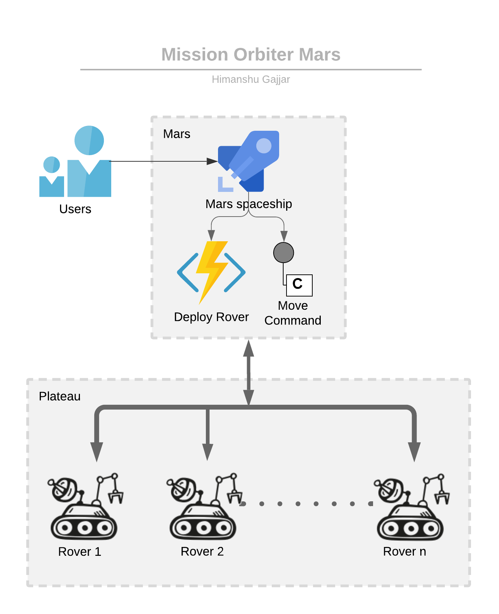
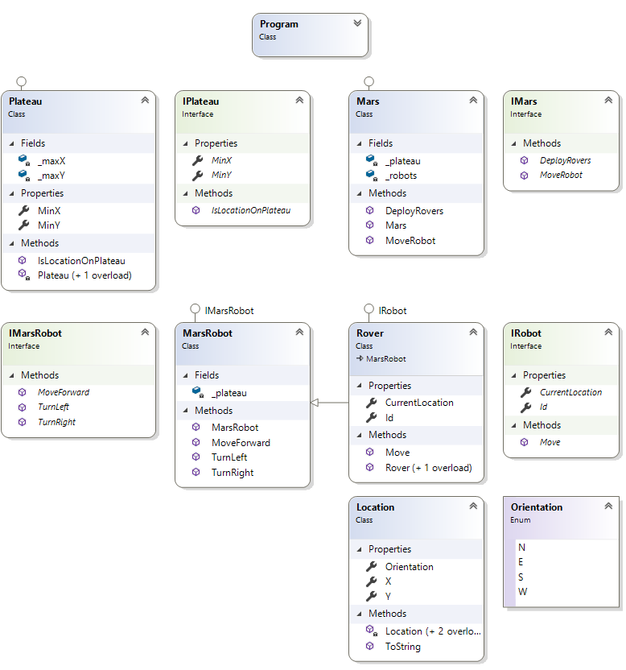
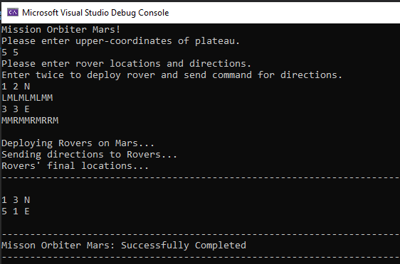

# Mission Orbiter Mars

### Overview

NASA is deploying rovers on Mars and sending command to move around on Mars plateau. After Deploying and sending directions each rover should send back the message with their current location. 

### Process

First NASA creates the plateau area boundary on Mars where rovers can roam around. Once after sending initial locations and directions Mars spaceship launches rovers on plateau. Mars spaceship knows about rover robots Identifiers and last location. Once move commands have been fired for each rover robots the move to given directions and returns their final locations.

### Visual Design

### Class Design

### Implementation

#### Mars

Mars Domain context is exposed only for deploying rovers and using rover capacity like `Move` command. `Mars` is extendable class if any other behaviour of the robot is being upgraded.

#### Plateau

Mars injects the Plateau to each rover. Rover knows about the plateau where they can roam around and covered with upper-right boundaries. Before executing `MoveForward` command it always checks `IsLocationOnPlateau`. If the location is outside then it logs the issue and does not execute any further commands. This results to leave the rover on boarder of plateau.

#### Rover

Rover is implementing `IRobot` behaviour which gives basic functionality to be implemented for each rover robot. As Mars class creates IRobots and allow to execute move commands.

#### MarsRobot

MarsRobot is base class of Rover and implements `IMarsRobot` interface. `IMarsRobot` behaviour is specific to robots which deployed to Mars. `MarsRobot` is open to extend and it can add any other behaviour of upgraded robots like IShoot to shoot or ICapture to capture picture and so on.

#### Location

Location is model class which has capability to hold robot location and orientation.

### How to use?

#### Development Tools
-	Visual studio 2019
-	.Net Core 3.1

Once you build and run the program it will prompt you to enter upper-right coordinates for plateau on Mars.
After entering location for rover and direction for each rover to drive on Mars.

To deploy all rovers press **Enter key** twice.

### Sample run

